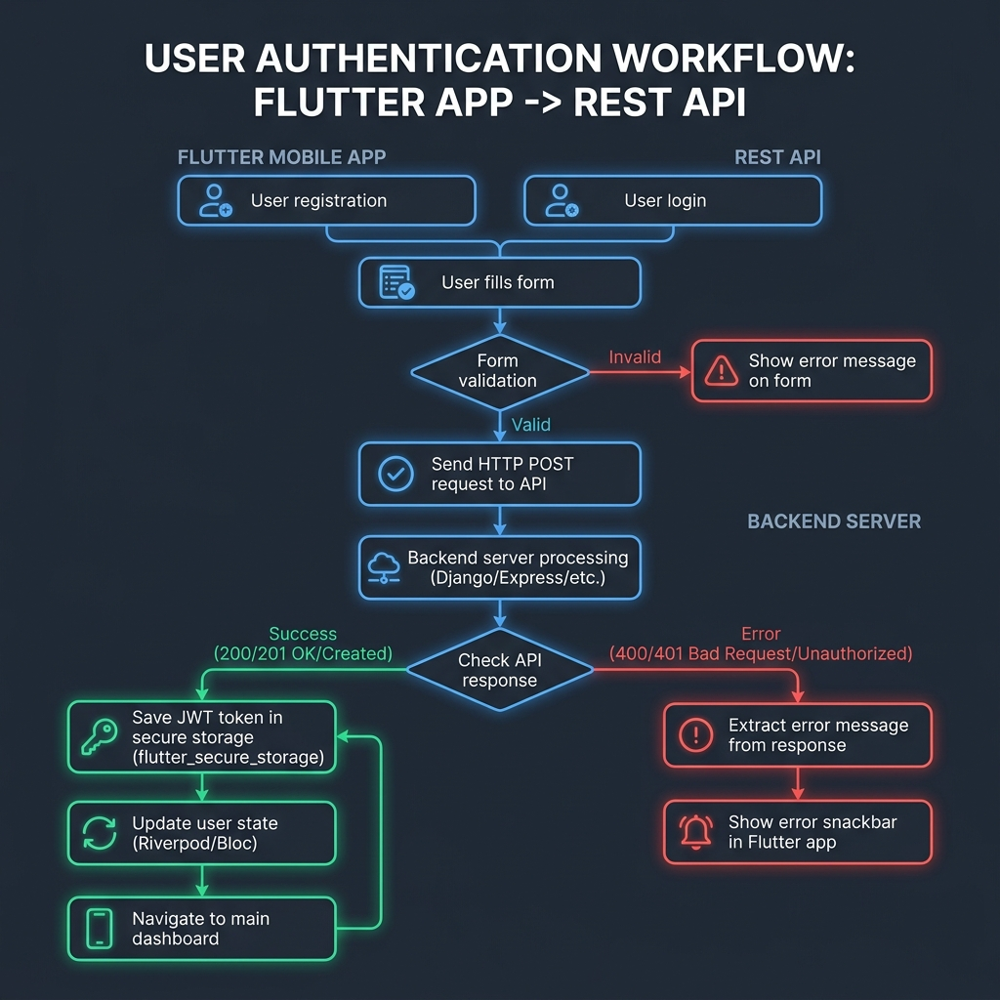
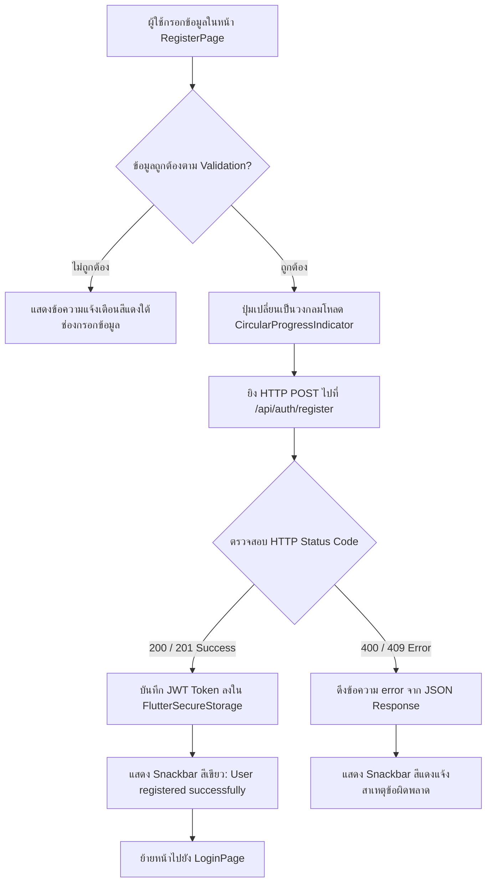
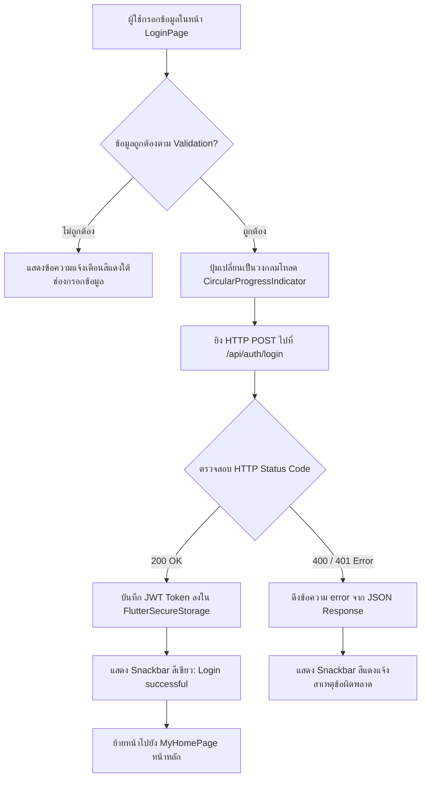

# 📱 คู่มือเรียนรู้การเชื่อมต่อ REST API & การจัดการ JWT Token ใน Flutter

คู่มือนี้จัดทำขึ้นเพื่อใช้ในการเรียนการสอนสำหรับการพัฒนาแอปพลิเคชัน Flutter ร่วมกับ **RESTful API Backend** โดยเน้นการเรียนรู้ระบบการยืนยันตัวตน (**Authentication Flow**) ได้แก่ การสมัครสมาชิก (Register), การเข้าสู่ระบบ (Login), การจัดการ Response Messages, การบันทึก JWT Token ด้วย `flutter_secure_storage` ปลอดภัยบนตัวเครื่อง และการทำระบบเข้าสู่ระบบอัตโนมัติ (Auto-Login Check)

---

## 📋 สารบัญ (Table of Contents)
- [🎯 วัตถุประสงค์การเรียนรู้ (Learning Objectives)](#-วัตถุประสงค์การเรียนรู้-learning-objectives)
- [🛠 เทคโนโลยีและ Packages ที่ใช้ (Tech Stack)](#-เทคโนโลยีและ-packages-ที่ใช้-tech-stack)
- [🏗️ สถาปัตยกรรมระบบ (System Architecture & Data Flow)](#️-สถาปัตยกรรมระบบ-system-architecture--data-flow)
- [📁 โครงสร้างโปรเจกต์ (Project Structure)](#-โครงสร้างโปรเจกต์-project-structure)
- [🔑 1. การจัดการ Token ด้วย `flutter_secure_storage`](#-1-การจัดการ-token-ด้วย-flutter_secure_storage)
- [🌐 2. การสร้าง HTTP Service เชื่อมต่อ API (`ApiService`)](#-2-การสร้าง-http-service-เชื่อมต่อ-api-apiservice)
- [📱 3. หน้าลงทะเบียนสมาชิก (`RegisterPage`)](#-3-หน้าลงทะเบียนสมาชิก-registerpage)
- [🔐 4. หน้าเข้าสู่ระบบ (`LoginPage`)](#-4-หน้าเข้าสู่ระบบ-loginpage)
- [🔄 5. ระบบเข้าสู่ระบบอัตโนมัติเมื่อเปิดแอป (`main.dart`)](#-5-ระบบเข้าสู่ระบบอัตโนมัติเมื่อเปิดแอป-maindart)
- [🚪 6. ระบบออกจากระบบ (Logout Flow)](#-6-ระบบออกจากระบบ-logout-flow)
- [🧪 7. ใบงานทดลองสำหรับนักศึกษา (Hands-on Lab Step-by-Step)](#-7-ใบงานทดลองสำหรับนักศึกษา-hands-on-lab-step-by-step)

---

## 🎯 วัตถุประสงค์การเรียนรู้ (Learning Objectives)

เมื่อศึกษาส่วนนี้ นักศึกษาจะสามารถ:
1. เข้าใจการรับ-ส่งข้อมูลรูปแบบ JSON ผ่าน HTTP POST / GET ด้วยแพ็กเกจ `http`
2. จัดการ **JWT (JSON Web Token)** และการรักษาความปลอดภัยข้อมูลผู้ใช้ด้วย `flutter_secure_storage`
3. จัดการสถานะ UI (Loading State) และการแจ้งเตือน Response Message สื่อสารกับผู้ใช้ด้วย `Get.snackbar`
4. จัดการข้อยกเว้น (Exception Handling) เมื่อ API ตอบกลับข้อผิดพลาด เช่น 400 Bad Request หรือ 401 Unauthorized
5. ทำระบบตรวจสอบสิทธิ์ผู้ใช้ก่อนเข้าสู่หน้าหลักของแอปพลิเคชัน (Auto-Login Navigation)

---

## 🛠 เทคโนโลยีและ Packages ที่ใช้ (Tech Stack)

* **Framework**: Flutter (Dart SDK)
* **State & Navigation**: [GetX](https://pub.dev/packages/get) (`get: ^4.7.3`)
* **HTTP Client**: [http](https://pub.dev/packages/http) (`http: ^1.6.0`)
* **Secure Storage**: [flutter_secure_storage](https://pub.dev/packages/flutter_secure_storage) (`flutter_secure_storage: ^11.0.0`)
* **Backend API Base URL**: `https://flutter-backend-iota.vercel.app/api`

---

## 🏗️ สถาปัตยกรรมระบบ (System Architecture & Data Flow)

### 🖼️ แผนภาพรวมการทำงาน (Authentication Flowchart Diagram)



---

### 📊 ผังกระบวนการสมัครสมาชิกและการเข้าสู่ระบบ (Detailed Flowcharts)

#### 1. กระบวนการสมัครสมาชิก (Register Flow)


#### 2. กระบวนการเข้าสู่ระบบ (Login Flow)


---

### แผนผังลำดับการทำงานระหว่างคลาส (Sequence Diagram)

```
[ User UI ] ──(1. Submit Form)──> [ Login/Register Page ]
                                          │
                                   (2. Call Api)
                                          ▼
                                   [ ApiService ] ──(3. HTTP POST JSON)──> [ Backend API Server ]
                                          │                                      │
                                   (5. Parse Data) <──(4. Return Token/JSON)──────┘
                                          │
                                 (6. Save Token)
                                          ▼
                                   [ TokenService ] ──(7. Write Encrypted)──> [ Flutter Secure Storage ]
                                          │
                                 (8. Navigate)
                                          ▼
                                   [ MyHomePage ]
```

---

## 📁 โครงสร้างโปรเจกต์ (Project Structure)

```text
lib/
├── auth/
│   ├── login.dart               # หน้าจอเข้าสู่ระบบ (Login UI & Logic)
│   ├── register.dart            # หน้าจอสมัครสมาชิก (Register UI & Logic)
│   └── welcome_page.dart        # หน้าต้อนรับเริ่มต้น
├── services/
│   ├── api_service.dart         # คลาสจัดการยิง HTTP Request ไปยัง Backend
│   └── token_service.dart       # คลาสจัดการบันทึก/อ่าน/ลบ JWT Token ในเครื่อง
├── components/
│   └── app_drawer.dart          # เมนูด้านข้าง (มีปุ่ม Logout)
├── main.dart                    # จุดเริ่มต้นแอป + ระบบ Auto-Login Check
└── my_home_page.dart            # หน้าหลักหลังเข้าสู่ระบบสำเร็จ
```

---

## 🔑 1. การจัดการ Token ด้วย `flutter_secure_storage`

ไฟล์: `lib/services/token_service.dart`

ทำไมต้องใช้ `flutter_secure_storage`?
- ต่างจาก `SharedPreferences` ตรงที่ข้อมูลจะถูก**เข้ารหัส (Encrypted)** ด้วย Keychain (iOS) หรือ KeyStore (Android) จึงปลอดภัยสำหรับการเก็บ JWT Token หรือข้อมูลความลับ

### โค้ดตัวอย่างใน `TokenService`:

```dart
import 'dart:convert';
import 'package:flutter_secure_storage/flutter_secure_storage.dart';

class TokenService {
  static const _storage = FlutterSecureStorage();
  static const _keyToken = 'jwt_token';
  static const _keyUser = 'user_data';

  /// บันทึก JWT Token ลงใน Secure Storage
  static Future<void> saveToken(String token) async {
    await _storage.write(key: _keyToken, value: token);
  }

  /// อ่านค่า JWT Token จาก Secure Storage
  static Future<String?> getToken() async {
    return await _storage.read(key: _keyToken);
  }

  /// ลบ JWT Token และข้อมูลโปรไฟล์ออกจากเครื่อง (ใช้ตอน Logout)
  static Future<void> deleteToken() async {
    await _storage.delete(key: _keyToken);
    await _storage.delete(key: _keyUser);
  }

  /// ตรวจสอบว่ามี Token อยู่ในเครื่องหรือยัง (ใช้ทำ Auto-Login)
  static Future<bool> hasToken() async {
    final token = await getToken();
    return token != null && token.trim().isNotEmpty;
  }

  /// บันทึกข้อมูลโปรไฟล์ผู้ใช้เป็น JSON String
  static Future<void> saveUserData(Map<String, dynamic> userData) async {
    await _storage.write(key: _keyUser, value: jsonEncode(userData));
  }

  /// ดึงข้อมูลโปรไฟล์ผู้ใช้
  static Future<Map<String, dynamic>?> getUserData() async {
    final dataStr = await _storage.read(key: _keyUser);
    if (dataStr != null && dataStr.isNotEmpty) {
      try {
        return jsonDecode(dataStr);
      } catch (_) {}
    }
    return null;
  }
}
```

---

## 🌐 2. การสร้าง HTTP Service เชื่อมต่อ API (`ApiService`)

ไฟล์: `lib/services/api_service.dart`

หน้าที่ของ `ApiService`:
1. ส่ง Request ในรูปแบบ `application/json`
2. พิมพ์ Response Log ออกทาง Debug Console ให้สังเกตง่าย
3. ตรวจสอบ **HTTP Status Code**:
   - `200 OK` หรือ `201 Created`: ดำเนินการสำเร็จ ➔ สั่ง `TokenService.saveToken()` อัตโนมัติ
   - `400 Bad Request` หรือ `401 Unauthorized`: สกัดข้อความในคีย์ `error` ➔ `throw Exception(errorMessage)`

### โค้ดตัวอย่างใน `ApiService`:

```dart
import 'dart:convert';
import 'package:flutter/foundation.dart';
import 'package:http/http.dart' as http;
import 'package:get_app/services/token_service.dart';

class ApiService {
  static const String baseUrl = 'https://flutter-backend-iota.vercel.app/api';

  /// 1. สมัครสมาชิก (POST /api/auth/register)
  static Future<Map<String, dynamic>> register({
    required String fname,
    required String lname,
    required String email,
    required String password,
  }) async {
    final url = Uri.parse('$baseUrl/auth/register');

    final response = await http.post(
      url,
      headers: {
        'Content-Type': 'application/json',
        'Accept': 'application/json',
      },
      body: jsonEncode({
        'fname': fname,
        'lname': lname,
        'email': email,
        'password': password,
      }),
    );

    // พิมพ์ Log ตอบกลับจากเซิร์ฟเวอร์
    debugPrint('================ [API RESPONSE LOG] ================');
    debugPrint('Endpoint: POST $url');
    debugPrint('Status Code: ${response.statusCode}');
    debugPrint('Response Body: ${response.body}');
    debugPrint('====================================================');

    final data = jsonDecode(response.body);

    if (response.statusCode == 200 || response.statusCode == 201) {
      if (data['token'] != null) await TokenService.saveToken(data['token']);
      if (data['user'] != null) await TokenService.saveUserData(data['user']);
      return data;
    } else {
      final errorMessage = data['error'] ?? 'เกิดข้อผิดพลาดในการลงทะเบียน (${response.statusCode})';
      throw Exception(errorMessage);
    }
  }

  /// 2. เข้าสู่ระบบ (POST /api/auth/login)
  static Future<Map<String, dynamic>> login({
    required String email,
    required String password,
  }) async {
    final url = Uri.parse('$baseUrl/auth/login');

    final response = await http.post(
      url,
      headers: {
        'Content-Type': 'application/json',
        'Accept': 'application/json',
      },
      body: jsonEncode({'email': email, 'password': password}),
    );

    debugPrint('================ [API RESPONSE LOG] ================');
    debugPrint('Endpoint: POST $url');
    debugPrint('Status Code: ${response.statusCode}');
    debugPrint('Response Body: ${response.body}');
    debugPrint('====================================================');

    final data = jsonDecode(response.body);

    if (response.statusCode == 200) {
      if (data['token'] != null) await TokenService.saveToken(data['token']);
      if (data['user'] != null) await TokenService.saveUserData(data['user']);
      return data;
    } else {
      final errorMessage = data['error'] ?? 'เกิดข้อผิดพลาดในการเข้าสู่ระบบ (${response.statusCode})';
      throw Exception(errorMessage);
    }
  }

  /// 3. ออกจากระบบ (POST /api/auth/logout)
  static Future<void> logout() async {
    final token = await TokenService.getToken();
    final url = Uri.parse('$baseUrl/auth/logout');

    try {
      final response = await http.post(
        url,
        headers: {
          'Content-Type': 'application/json',
          'Accept': 'application/json',
          if (token != null) 'Authorization': 'Bearer $token',
        },
      );
      debugPrint('Logout Status Code: ${response.statusCode}');
    } catch (e) {
      debugPrint('Logout Error: $e');
    } finally {
      // ลบ Token ออกจากตัวเครื่องเสมอ
      await TokenService.deleteToken();
    }
  }
}
```

---

## 📱 3. หน้าลงทะเบียนสมาชิก (`RegisterPage`)

ไฟล์: `lib/auth/register.dart`

### จุดสำคัญในการเขียนโค้ด:
1. **Form Validation**: ตรวจสอบช่องกรอกข้อมูล ชื่อ, นามสกุล, อีเมล (`GetUtils.isEmail`), และรหัสผ่าน
2. **State Management (`_isLoading`)**: ปุ่มกดยืนยันจะถูกเปลี่ยนเป็นวงกลมโหลด (`CircularProgressIndicator`) ขณะรอยิง API
3. **Response Handling**:
   - ถ้าสำเร็จ: แสดง **Snackbar สีเขียว** ด้วยข้อความจาก `result['message']`
   - ถ้าไม่สำเร็จ: Catch ข้อยกเว้น และแสดง **Snackbar สีแดง** ด้วยข้อความจาก `errorMessage`

```dart
Future<void> _handleRegister() async {
  if (!_formKey.currentState!.validate()) return;

  setState(() => _isLoading = true);

  try {
    final result = await ApiService.register(
      fname: _fnameController.text.trim(),
      lname: _lnameController.text.trim(),
      email: _emailController.text.trim(),
      password: _passwordController.text,
    );

    // แสดง Snackbar เขียวเมื่อสำเร็จ
    Get.snackbar(
      'สำเร็จ',
      result['message'] ?? 'ลงทะเบียนผู้ใช้สำเร็จ',
      snackPosition: SnackPosition.BOTTOM,
      backgroundColor: const Color(0xFF10B981),
      colorText: Colors.white,
    );

    // ย้ายไปหน้าล็อกอิน
    Get.off(() => const LoginPage());
  } catch (e) {
    final errorMessage = e.toString().replaceAll('Exception: ', '');
    // แสดง Snackbar แดงเมื่อมี Error
    Get.snackbar(
      'ลงทะเบียนไม่สำเร็จ',
      errorMessage,
      snackPosition: SnackPosition.BOTTOM,
      backgroundColor: const Color(0xFFEF4444),
      colorText: Colors.white,
    );
  } finally {
    if (mounted) setState(() => _isLoading = false);
  }
}
```

---

## 🔐 4. หน้าเข้าสู่ระบบ (`LoginPage`)

ไฟล์: `lib/auth/login.dart`

```dart
Future<void> _handleLogin() async {
  if (!_formKey.currentState!.validate()) return;

  setState(() => _isLoading = true);

  try {
    final result = await ApiService.login(
      email: _emailController.text.trim(),
      password: _passwordController.text,
    );

    Get.snackbar(
      'เข้าสู่ระบบสำเร็จ',
      result['message'] ?? 'ยินดีต้อนรับเข้าสู่ระบบ',
      snackPosition: SnackPosition.BOTTOM,
      backgroundColor: const Color(0xFF10B981),
      colorText: Colors.white,
    );

    // เข้าสู่หน้าหลักทันที (Token ถูกบันทึกแล้วใน ApiService)
    Get.offAll(() => const MyHomePage());
  } catch (e) {
    final errorMessage = e.toString().replaceAll('Exception: ', '');
    Get.snackbar(
      'เข้าสู่ระบบไม่สำเร็จ',
      errorMessage,
      snackPosition: SnackPosition.BOTTOM,
      backgroundColor: const Color(0xFFEF4444),
      colorText: Colors.white,
    );
  } finally {
    if (mounted) setState(() => _isLoading = false);
  }
}
```

---

## 🔄 5. ระบบเข้าสู่ระบบอัตโนมัติเมื่อเปิดแอป (`main.dart`)

ไฟล์: `lib/main.dart`

ใช้ `FutureBuilder` เช็ค `TokenService.hasToken()`:
- ถ้ามี Token ➔ เปิดหน้า `MyHomePage` ทันที
- ถ้าไม่มี Token ➔ เปิดหน้า `WelcomePage`

```dart
home: FutureBuilder<bool>(
  future: TokenService.hasToken(),
  builder: (context, snapshot) {
    if (snapshot.connectionState == ConnectionState.waiting) {
      return const Scaffold(
        body: Center(
          child: CircularProgressIndicator(color: Color(0xFF0F172A)),
        ),
      );
    }
    if (snapshot.data == true) {
      return const MyHomePage(); // เคยล็อกอินแล้ว
    }
    return const WelcomePage(); // ยังไม่ได้ล็อกอิน
  },
),
```

---

## 🚪 6. ระบบออกจากระบบ (Logout Flow)

ไฟล์: `lib/components/app_drawer.dart`

เมื่อผู้ใช้กดปุ่ม **"ออกจากระบบ"** ใน Drawer เมนูด้านข้าง:

```dart
_buildDrawerItem(
  icon: Icons.logout_rounded,
  title: 'ออกจากระบบ (Logout)',
  color: const Color(0xFFEF4444),
  onTap: () {
    Get.back();
    Get.defaultDialog(
      title: "ออกจากระบบ",
      middleText: "คุณต้องการออกจากระบบใช่หรือไม่?",
      textConfirm: "ออกจากระบบ",
      textCancel: "ยกเลิก",
      confirmTextColor: Colors.white,
      buttonColor: const Color(0xFFEF4444),
      onConfirm: () async {
        // ยิง API เพิกถอน Token และลบ Secure Storage
        await ApiService.logout();
        // พากลับหน้าเริ่มต้น
        Get.offAll(() => const WelcomePage());
      },
    );
  },
);
```

---

## 🧪 7. ใบงานทดลองสำหรับนักศึกษา (Hands-on Lab Step-by-Step)

### 📍 การทดลองที่ 1: สมัครสมาชิกใหม่ (Register Test)
1. รันแอปพลิเคชันด้วย `flutter run`
2. กดปุ่ม **สร้างบัญชีผู้ใช้ใหม่**
3. ทดลองกดปุ่มสมัครโดยไม่กรอกข้อมูล ➔ สังเกต Validation Message สีแดงใต้ฟิลด์
4. กรอกข้อมูล ชื่อ, นามสกุล, อีเมล และรหัสผ่าน (ความยาว >= 6 ตัวอักษร)
5. กดปุ่ม **สมัครสมาชิก**
6. สังเกต Log ใน Terminal:
   - สังเกต **Status Code: 201**
   - สังเกต Snackbar แจ้งเตือนสำเร็จสีเขียว `"User registered successfully"`

### 📍 การทดลองที่ 2: ทดสอบการจัดการ Error (Duplicate Email Test)
1. ทดลองกดสมัครสมาชิกด้วยอีเมลเดิมซ้ำอีกครั้ง
2. สังเกต Log ใน Terminal:
   - สังเกต **Status Code: 400** หรือ **409**
   - สังเกต Snackbar สีแดงแจ้งเตือน `"Email already registered"`

### 📍 การทดลองที่ 3: เข้าสู่ระบบและการบันทึก Token (Login & Token Storage Test)
1. เปิดหน้า **เข้าสู่ระบบ**
2. กรอกอีเมลและรหัสผ่านที่สมัครไว้
3. กดปุ่ม **เข้าสู่ระบบ** ➔ ระบบนำทางไปยังหน้าหลัก (`MyHomePage`)
4. สังเกต Console Log ว่ามี `token` ตอบกลับมาและถูกบันทึกลง `FlutterSecureStorage`

### 📍 การทดลองที่ 4: ทดสอบ Auto-Login
1. ทำการกด Hot Restart (`R`) หรือปิดแอปแล้วเปิดขึ้นใหม่
2. สังเกตว่าแอปจะวิ่งตรงไปที่หน้า **MyHomePage** ทันทีโดยไม่ต้องกรอกรหัสผ่านซ้ำ

### 📍 การทดลองที่ 5: ทดสอบ Logout
1. ปัดหน้าจอเปิด เมนูด้านข้าง (Drawer)
2. กดปุ่ม **ออกจากระบบ** ➔ กดยืนยัน
3. สังเกตว่า Token ในเครื่องจะถูกลบ และแอปนำทางกลับมาที่หน้า **WelcomePage**
4. ทดลอง Hot Restart (`R`) อีกครั้ง ➔ แอปจะเปิดที่หน้า **WelcomePage** เนื่องจาก Token ถูกลบออกเรียบร้อยแล้ว
